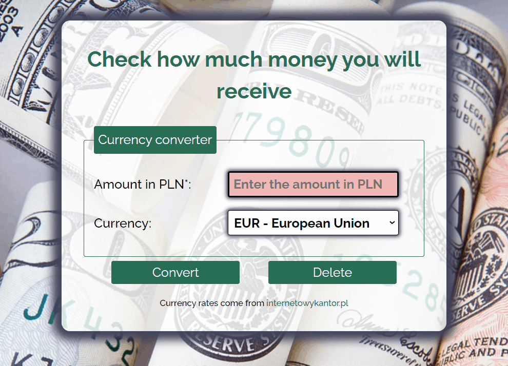

# Currency converter
## Short description
I created a simple currency converter that will check how much money you would receive by exchanging PLN for one of the four available currencies.
## Technologies used
- HTML
- CSS
- JavaScript
- BEM
- ES6+ features
- FLex
## Check it out!
https://kamila2201.github.io/en-currency-converter/

